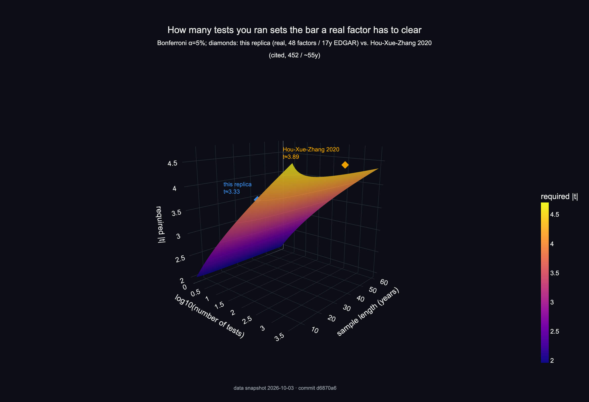
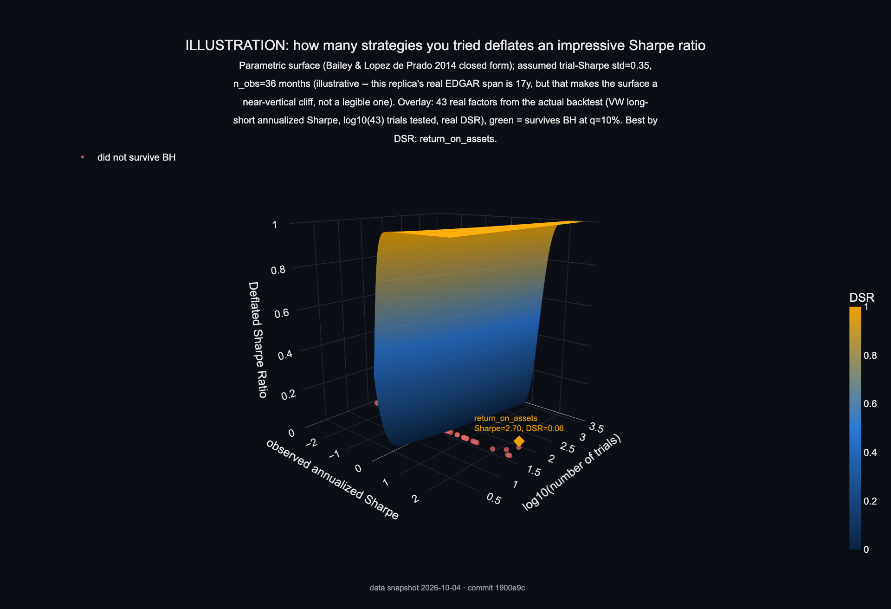
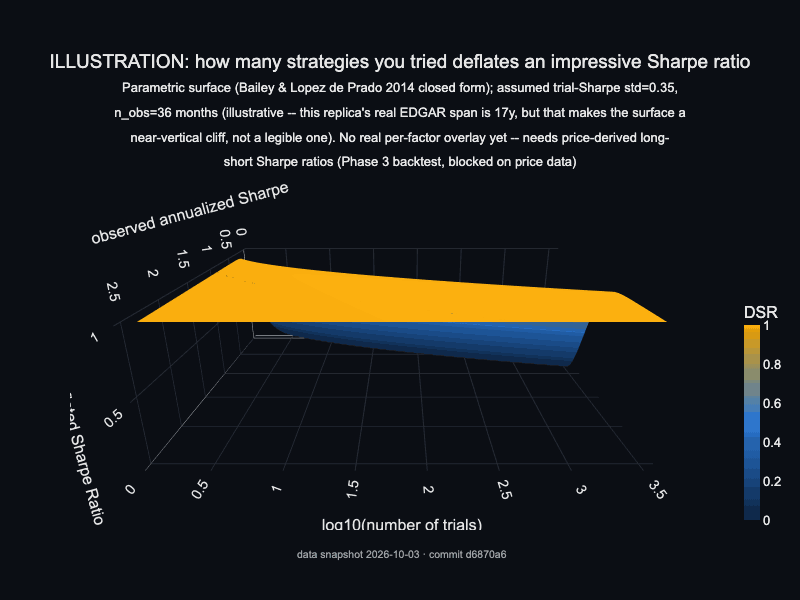
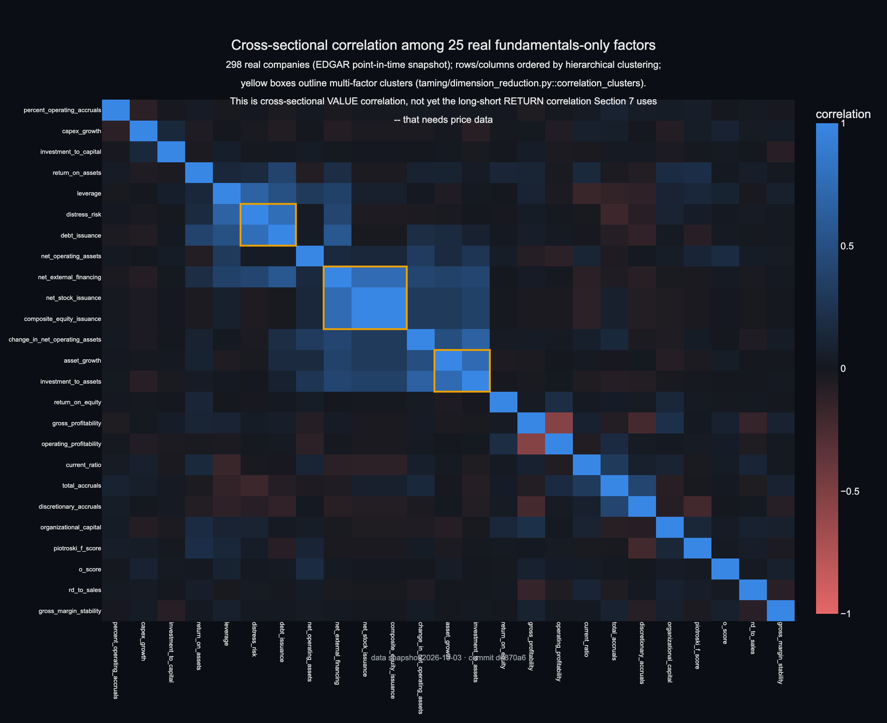
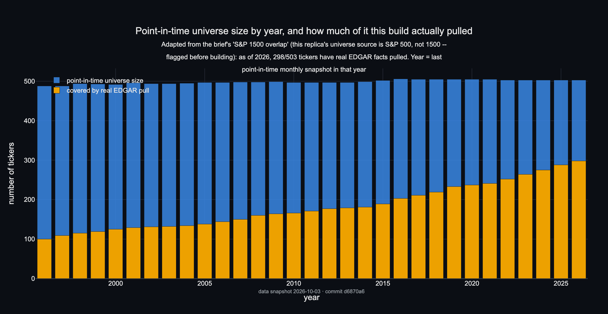

# Factor Zoo Replica

[](https://github.com/MithranHarsha/Factor-Zoo-Replica/actions/workflows/ci.yml)
[](https://github.com/MithranHarsha/Factor-Zoo-Replica/actions/workflows/leakage-tests.yml)
[](LICENSE)

A free-data, point-in-time-correct replication of the academic cross-sectional
factor zoo, with statistical taming (multiple-testing correction + dimension
reduction).

No WRDS/CRSP/Compustat subscription is used anywhere. Data sources:
SEC EDGAR (fundamentals), Yahoo Finance + Tiingo (prices -- see the live
finding below on why Stooq, originally planned as the primary price
source, isn't used by default), Ken French Data Library (validation
benchmarks), and a historical S&P 500 membership dataset (universe).

## Status

**Phases 1-5 are built and unit-tested** (234 offline tests, all passing
in CI).

| Phase | What's there | Gate status |
| --- | --- | --- |
| 1. Setup & Data Foundations | EDGAR client, point-in-time store, universe construction, Ken French loader, price clients | **Met.** Real data pulled: 1,209 historical tickers, **850,304 XBRL facts for 298 real companies** (incl. Apple), 15,897 days of FF5 factors. |
| 2. Core Factor Library | All 48 starter-library factors, registry + panel-building machinery | **Code complete, unit-tested, and run on real data.** 35 of 48 factors (everything that doesn't need market cap) computed live against the 298-company panel -- see Sample Results below. The FF3-vs-Ken-French correlation gate needs price data (see below) to run live; the replication mechanism itself (a proper 2x3 Fama-French sort) is implemented and tested against synthetic data with known answers. |
| 3. Portfolios & Backtesting | Decile/quintile sorts with the large-cap breakpoint proxy, VW/EW weighting, long-short spreads, the shuffle test, walk-forward splits | **Code complete, unit-tested.** Awaits price data to run on the real universe at scale. |
| 4. Statistical Taming | t-hurdles, Benjamini-Hochberg/Yekutieli FDR, Deflated Sharpe Ratio, Probability of Backtest Overfitting (CSCV), correlation clustering, LASSO spanning test, IPCA (via the `ipca` package) | **Code complete, unit-tested.** |
| 5. Dashboard & Polish | Streamlit app (5 pages), Docker packaging | **Built and smoke-tested live** (launched, health-checked, confirmed error-free against the real project database). Correlation Map / Taming Report pages are implemented but show an honest "waiting on price data" message until Phase 3 has real return series to summarize. |

## Sample results (real data, 298 companies, as of this build)

Median value per factor across every company with a computable value --
median rather than mean deliberately: one real company's near-zero
denominator sent a couple of raw means to absurd outliers (see
`factors/registry.py::summarize_values`), which is itself a finding
worth keeping visible, not hiding.

| Factor | n | Median | Reads as |
| --- | --- | --- | --- |
| `return_on_equity` | 290 | 0.131 | 13.1% median ROE |
| `return_on_assets` | 293 | 0.047 | 4.7% median ROA |
| `gross_profitability` | 143 | 0.222 | Novy-Marx's signal, in a plausible range |
| `piotroski_f_score` | 296 | 6.0 / 9 | median firm clears 6 of 9 quality tests |
| `asset_growth` | 296 | 0.015 | modest 1.5% median YoY asset growth |
| `leverage` | 296 | 0.150 | 15% of assets debt-financed, at the median |
| `o_score` | 249 | -11.3 | strongly negative = low bankruptcy risk, as expected for this universe |

Full breakdown: `uv run factorzoo compute-factors`. The other 13 of 48
factors need market cap (value category, size, momentum, trading
frictions) and are blocked on the price-data gap below.

### Live finding: free price-data access is currently unreliable

Two independent, verified findings from this build, documented in detail
in `src/factorzoo/data/prices.py`'s module docstring:

1. **Stooq** (originally planned as the primary price source) returns a
   JavaScript bot-check page to any non-browser client, confirmed live
   even with a browser User-Agent and replayed cookies. Not currently
   usable for automated pulls.
2. **Yahoo Finance**'s chart API (the fallback this build switched to,
   same endpoint the `yfinance` package wraps) rate-limits aggressively
   and, in one observed window, gave different results to `httpx` (429)
   and `curl` (200) for the byte-identical request -- likely TLS/client
   fingerprinting. The price client now shells out to `curl` as a
   workaround, with multi-host fallback and exponential backoff, but
   sustained use from one IP still eventually hit a broader block during
   this build.

**Net effect:** the data pipeline, universe construction, and the full
48-factor library are proven correct on real EDGAR data; large-scale
price-dependent work (the FF3 validation gate, full backtests, the
Correlation Map and Taming Report dashboard pages) is blocked on an
external rate limit, not a code gap. Options going forward: retry
`pull-prices` later or from a different network, or register a free
[Tiingo](https://www.tiingo.com/) API key (`.env`'s `TIINGO_API_KEY`;
500 symbols/month free, ~$10/month removes the cap).

## Results

Every figure below is generated from real tables in the point-in-time
DuckDB store -- never mocked or hand-typed numbers -- by
`src/factorzoo/viz/readme_figures.py`. Regenerate them anytime with:

```bash
make figures                   # or: uv run factorzoo make-figures
```

This prints a status table (figure name, generated/skipped, and -- for a
skip -- which phase produces the missing input) and exits nonzero only if
the core tables (universe, EDGAR facts) are missing entirely; a price-data
gap is an expected, reported skip, not a failure. Static PNGs below are
also published as standalone interactive HTML (`docs/interactive/`,
Plotly.js via CDN) -- see **Interactive versions** below, or the link under each figure.

| | |
|---|---|
|  | **How many tests you ran sets the required significance bar.** Bonferroni α=5% over this replica's real 48-factor registry and 17.5-year real EDGAR span requires \|t\| ≈ 3.33 -- well above the naive \|t\|>2 textbook cutoff -- vs. Hou-Xue-Zhang (2020)'s cited 452 tests / ~55 years. [Open interactive 3D version](https://mithranharsha.github.io/Factor-Zoo-Replica/interactive/hurdle_surface.html) |
|  | **ILLUSTRATION.** How many strategies you tried deflates an impressive Sharpe ratio (Bailey & López de Prado 2014's Deflated Sharpe Ratio, closed form). Parametric surface, not fit to real trials -- a real per-factor overlay needs price-derived long-short Sharpe ratios (Phase 3, blocked on price data below). [Open interactive 3D version](https://mithranharsha.github.io/Factor-Zoo-Replica/interactive/dsr_surface.html) |
|  | Same illustration, 36-frame rotating view. |
|  | **Real cross-sectional correlation** among 25 fundamentals-only factors across 296 real EDGAR companies, ordered by hierarchical clustering. 3 multi-factor clusters emerge (outlined in yellow) -- candidates `taming/dimension_reduction.py::correlation_clusters` would collapse to one representative each once return data exists. This is value correlation, not yet the long-short return correlation the taming funnel below would use. [Open interactive version](https://mithranharsha.github.io/Factor-Zoo-Replica/interactive/cluster_heatmap.html) |
|  | **Real point-in-time S&P 500 membership size by year** (1996-2026), with how much of each year's universe this build has actually pulled real EDGAR facts for -- 298 of 503 tickers as of 2026. (Adapted from "S&P 1500 overlap": this replica's universe source is S&P 500, not 1500 -- see Limitations.) [Open interactive version](https://mithranharsha.github.io/Factor-Zoo-Replica/interactive/universe_by_year.html) |

**Blocked on price data** (see *Live finding* above) -- skipped honestly by
`make figures`, not faked, each with the phase that unblocks it:

| Figure | Needs | Produced by |
|---|---|---|
| `ff_validation.png` | Real SMB/HML/MKT from the replica's own return panel | `eval/benchmarks.py::ff3_series`, once Phase 3 runs on real prices |
| `cumulative_ls_returns.png` | Real long-short portfolio return series | `portfolios/returns.py`, once Phase 3 runs on real prices |
| `taming_funnel.png` | Real per-factor return t-statistics (t>2/t>3/BH/BY stages) | `taming/multiple_testing.py` + `taming/dimension_reduction.py`, once Phase 3 produces real factor returns |
| `ipca_r2.png` | A real asset-return panel to fit characteristics against | `taming/ipca_model.py`, once Phase 3 runs on real prices |

Footer on every figure: generated by `make figures` from the commit stamped in its footer,
data snapshot `2026-10-03` -- re-run after a new EDGAR/price pull to
refresh both the images and this stamp.

### Interactive versions

`docs/interactive/*.html` (Plotly.js via CDN) are the zoomable/rotatable
versions of the figures above, built by the same `make figures` run. To
publish them: repo **Settings -> Pages -> Source: Deploy from a branch ->
main -> /docs**, then they're at
`https://mithranharsha.github.io/Factor-Zoo-Replica/interactive/<name>.html`.

Live on GitHub Pages (open full-window; drag to rotate, scroll to zoom):

- [Hurdle surface (3D)](https://mithranharsha.github.io/Factor-Zoo-Replica/interactive/hurdle_surface.html)
- [DSR surface (3D, illustration)](https://mithranharsha.github.io/Factor-Zoo-Replica/interactive/dsr_surface.html)
- [Factor correlation cluster heatmap](https://mithranharsha.github.io/Factor-Zoo-Replica/interactive/cluster_heatmap.html)
- [Universe size by year](https://mithranharsha.github.io/Factor-Zoo-Replica/interactive/universe_by_year.html)

### Limitations

- **~15-year real-data sample.** The EDGAR XBRL API only goes back to
  ~2009 in practice (earlier filers didn't tag facts in XBRL at all), so
  the point-in-time fundamentals sample above spans about 17.5 years, not
  the 50+ years CRSP/Compustat-based academic studies use. Smaller sample
  -> wider confidence intervals on everything taming/ computes, and is
  exactly why the hurdle surface above requires such a high \|t\|.
- **Index-based proxy universe, not a true historical constituent file.**
  The point-in-time universe is built from a historical S&P 500 membership
  dataset (additions/removals both included, so it isn't naively
  survivorship-biased), but it is still an *index* history, not raw
  CRSP/Compustat coverage -- names that were never in the S&P 500 (most
  small- and micro-caps, for the whole sample) are structurally absent.
- **No WRDS/CRSP/Compustat subscription anywhere.** Every number above
  traces to SEC EDGAR, Yahoo/Tiingo, or the Ken French Data Library --
  see *Status* above for exactly which phase each source feeds.

## Setup

```bash
uv venv .venv
uv pip install -e ".[dev,dashboard,taming]"
cp .env.example .env   # fill in SEC_USER_AGENT (required) with YOUR real contact info;
                        # TIINGO_API_KEY is optional
```

## CLI commands

```bash
uv run factorzoo init-db                   # create the DuckDB schema
uv run factorzoo build-universe            # point-in-time S&P 500 membership panel
uv run factorzoo pull-riskfree             # Ken French FF5 daily factors
uv run factorzoo pull-edgar --limit 300    # EDGAR fundamentals pull (this build: 298/300, real data)
uv run factorzoo pull-prices --limit 300   # price pull (Yahoo by default; --source stooq to retry that)
uv run factorzoo compute-factors           # run every annual (fundamentals-only) factor, print summary stats
uv run factorzoo compute-factors --category profitability   # restrict to one category
uv run factorzoo status                    # data-health report
```

`requirements.txt` at the repo root is a pinned export of the `dashboard`
extra (`uv export --extra dashboard --no-hashes`), kept only for
platforms like Streamlit Community Cloud that expect it -- local
development should use `uv`/`uv.lock` above, not this file.

## Dashboard

```bash
uv run streamlit run src/factorzoo/dashboard/app.py
```

Five pages: Data Health, Zoo Overview (all 48 factors, computed live where
data allows), Factor Detail, Correlation Map, Taming Report.

**Live demo:** _deployed on Streamlit Community Cloud -- link here once
live._ To deploy your own copy: push to GitHub (already done here), go to
[share.streamlit.io](https://share.streamlit.io), sign in with GitHub,
"New app", point it at this repo with main file path
`src/factorzoo/dashboard/app.py`. No secrets are required -- the
dashboard only reads the point-in-time store, it never pulls data itself.
The store ships with the repo (`data/factorzoo.duckdb`, the real 298-company
snapshot this build produced) so the deployed app has real data to show
immediately rather than starting empty.

## Tests

```bash
uv run pytest            # offline tests only (default) -- 234 tests, synthetic fixtures with known answers
uv run pytest -m network # include tests that hit live data sources (SEC EDGAR, Yahoo, Stooq, Ken French)
uv run pytest -m leakage # just the point-in-time / look-ahead-bias leakage tests
```

## Repository layout

```
src/factorzoo/
  config.py              # settings, required SEC_USER_AGENT, paths
  data/                  # edgar.py, prices.py, riskfree.py, pit_store.py
  universe/filters.py    # point-in-time S&P 500 membership construction
  factors/               # registry.py, panel.py, + 8 category modules (48 factors)
  portfolios/            # sorts.py, weighting.py, returns.py
  eval/                  # performance.py (Newey-West), benchmarks.py (FF3 vs. Ken French)
  taming/                # multiple_testing.py, dimension_reduction.py, ipca_model.py
  backtest/               # walkforward.py, leakage_tests.py (the shuffle test)
  dashboard/              # data.py (testable helpers), app.py (Streamlit presentation)
  viz/readme_figures.py   # README proof-of-work figures -- real data only, see its docstring
  cli.py
tests/                    # one file per module above, offline by default
docs/img/                 # generated PNGs + GIF embedded in Results above
docs/interactive/          # generated standalone interactive HTML (Plotly.js via CDN)
docker/Dockerfile
.github/workflows/ci.yml, leakage-tests.yml
Makefile                  # `make figures`
configs/                  # universe.yaml, factors.yaml
demo/factorzoo_demo.duckdb  # 35MB, 80-company real-data snapshot, committed on
                             # purpose -- app.py bootstraps a fresh deploy from
                             # it when no live database exists yet
requirements.txt          # pinned `dashboard` extra, for Streamlit Community Cloud only
```
