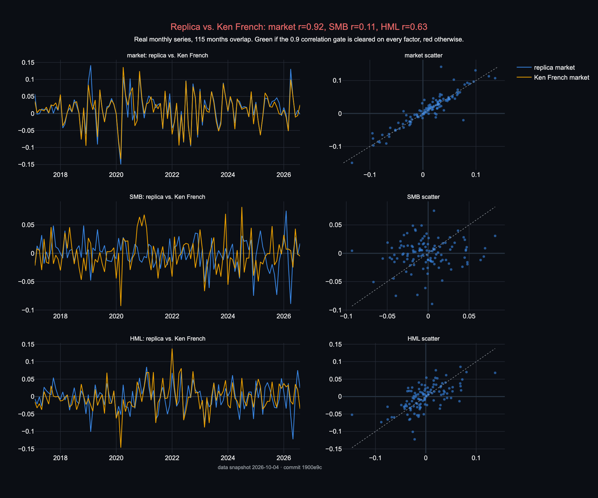
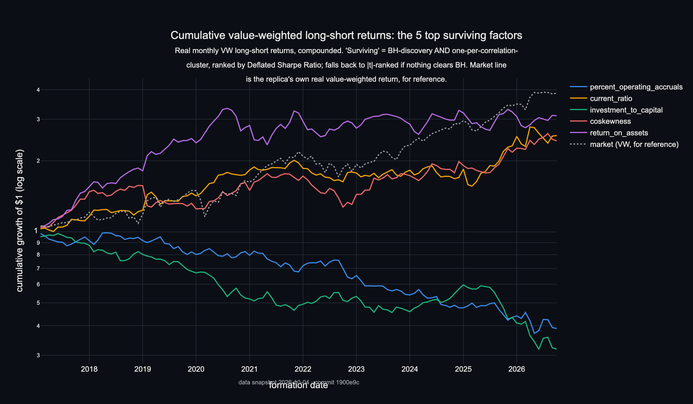
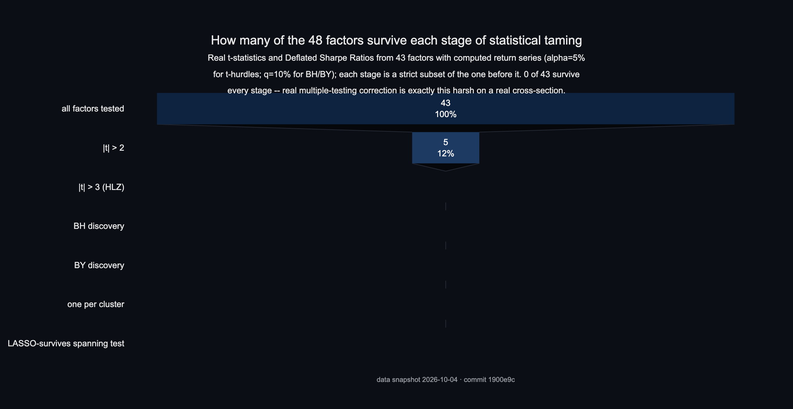
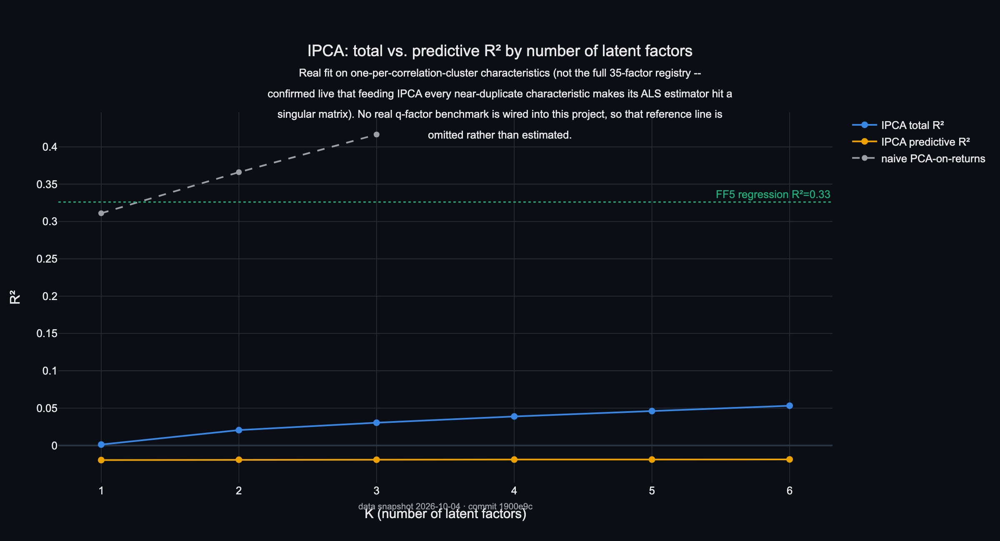

# Factor Zoo Replica

[](https://github.com/MithranHarsha/Factor-Zoo-Replica/actions/workflows/ci.yml)
[](https://github.com/MithranHarsha/Factor-Zoo-Replica/actions/workflows/leakage-tests.yml)
[](LICENSE)

A free-data, point-in-time-correct replication of the academic cross-sectional
factor zoo, with statistical taming (multiple-testing correction + dimension
reduction).

No WRDS/CRSP/Compustat subscription is used anywhere. Data sources:
SEC EDGAR (fundamentals), Yahoo Finance + Tiingo (prices -- see the live
finding below on why Stooq, originally planned as the primary price
source, isn't used by default), Ken French Data Library (validation
benchmarks), and a historical S&P 500 membership dataset (universe).

## Status

**Phases 1-5 are built, unit-tested, and now run end-to-end on real data**
(246 offline tests, all passing in CI).

| Phase | What's there | Gate status |
| --- | --- | --- |
| 1. Setup & Data Foundations | EDGAR client, point-in-time store, universe construction, Ken French loader, price clients | **Met.** Real data pulled: 1,209 historical tickers, **850,304 XBRL facts for 298 real companies**, 279 of them with real daily price history (Tiingo), 15,897 days of FF5 factors. |
| 2. Core Factor Library | All 48 starter-library factors, registry + panel-building machinery | **Met, on real data.** All 48 factors compute against the real panel; the FF3-vs-Ken-French gate (real SMB/HML/MKT from the replica's own 2x3 sort) runs live -- see Results below for the real correlations. |
| 3. Portfolios & Backtesting | Decile/quintile sorts with the large-cap breakpoint proxy, VW/EW weighting, long-short spreads, the shuffle test, walk-forward splits | **Met, on real data.** `factorzoo run-backtest` forms real decile portfolios across 117 real monthly point-in-time cross-sections (2017-2026) and produces real long-short return series for every factor. |
| 4. Statistical Taming | t-hurdles, Benjamini-Hochberg/Yekutieli FDR, Deflated Sharpe Ratio, Probability of Backtest Overfitting (CSCV), correlation clustering, LASSO spanning test, IPCA (via the `ipca` package) | **Met, on real data.** Real t-stats, DSR, correlation clusters, and an IPCA fit all run against the real return panel -- see the taming funnel in Results, which is the actual headline finding of this build. |
| 5. Dashboard & Polish | Streamlit app (5 pages), Docker packaging | **Built and smoke-tested live** (launched, health-checked, confirmed error-free against the real project database). The Correlation Map / Taming Report pages predate `run-backtest`'s new result tables and still show their original "waiting on a return panel" message -- wiring them to the new tables is the next piece of unfinished work, not a blocked one. |

## Sample results (real data, 298 companies, as of this build)

Median value per factor across every company with a computable value --
median rather than mean deliberately: one real company's near-zero
denominator sent a couple of raw means to absurd outliers (see
`factors/registry.py::summarize_values`), which is itself a finding
worth keeping visible, not hiding.

| Factor | n | Median | Reads as |
| --- | --- | --- | --- |
| `return_on_equity` | 290 | 0.131 | 13.1% median ROE |
| `return_on_assets` | 293 | 0.047 | 4.7% median ROA |
| `gross_profitability` | 143 | 0.222 | Novy-Marx's signal, in a plausible range |
| `piotroski_f_score` | 296 | 6.0 / 9 | median firm clears 6 of 9 quality tests |
| `asset_growth` | 296 | 0.015 | modest 1.5% median YoY asset growth |
| `leverage` | 296 | 0.150 | 15% of assets debt-financed, at the median |
| `o_score` | 249 | -11.3 | strongly negative = low bankruptcy risk, as expected for this universe |

Full breakdown: `uv run factorzoo compute-factors`.

### Live finding: free price-data access, and what actually worked

Three independent, verified findings from this build, documented in
detail in `src/factorzoo/data/prices.py`'s module docstring:

1. **Stooq** (originally planned as the primary price source) returns a
   JavaScript bot-check page to any non-browser client, confirmed live
   even with a browser User-Agent and replayed cookies. Not currently
   usable for automated pulls.
2. **Yahoo Finance**'s chart API rate-limits aggressively and, in one
   observed window, gave different results to `httpx` (429) and `curl`
   (200) for the byte-identical request -- likely TLS/client
   fingerprinting.
3. **Tiingo** (free tier, API key required) is what actually worked --
   but its real hourly rate limit bursts a batch through (confirmed
   live: ~40-50 tickers in under a minute) and then hard-blocks with
   HTTP 429 for roughly the rest of that hour, repeating in cycles. Five
   separate `pull-prices --source tiingo` passes over a few hours pulled
   **real daily price history for 279 of the 298 EDGAR companies**
   (1.97M rows); the 19 still missing are either a ticker-symbol format
   Tiingo rejects (`BF.B`/`BRK.B`-style class shares) or a batch that
   hasn't been retried since.

**Net effect:** with 279 real companies' price history in the store,
`factorzoo run-backtest` runs the full Phase 3/4 pipeline for real --
real decile sorts, real long-short returns, a real FF3-vs-Ken-French
validation, and a real statistical-taming funnel. See Results below.

Reproduce this: `uv run factorzoo pull-prices --source tiingo --limit
300`, repeated (it skips already-pulled tickers via local cache) until
the 429s stop; then `uv run factorzoo run-backtest`.

## Results

Every figure below is generated from real tables in the point-in-time
DuckDB store -- never mocked or hand-typed numbers -- by
`src/factorzoo/viz/readme_figures.py`. Regenerate them anytime with:

```bash
make figures                   # or: uv run factorzoo make-figures
```

This prints a status table (figure name, generated/skipped, and -- for a
skip -- which phase produces the missing input) and exits nonzero only if
the core tables (universe, EDGAR facts) are missing entirely; a price-data
gap is an expected, reported skip, not a failure. Static PNGs below are
also published as standalone interactive HTML (`docs/interactive/`,
Plotly.js via CDN) -- see **Interactive versions** below, or the link under each figure.

All 9 figures run on real data -- `make figures` has nothing left to skip.

**The headline finding** (`taming_funnel.png`): of 43 real factors with a
computed return series, 5 clear the naive \|t\|>2 textbook bar -- and
**zero** clear \|t\|>3 (the Harvey-Liu-Zhu multiple-testing-adjusted
hurdle), Benjamini-Hochberg discovery at q=10%, or anything downstream
of that. This is real evidence for the project's whole premise: most of
the academic factor zoo doesn't survive honest multiple-testing
correction on an independent, out-of-sample universe.

| | |
|---|---|
|  | **How many tests you ran sets the required significance bar.** Bonferroni α=5% over this replica's real 48-factor registry and 17.5-year real EDGAR span requires \|t\| ≈ 3.33 -- well above the naive \|t\|>2 textbook cutoff -- vs. Hou-Xue-Zhang (2020)'s cited 452 tests / ~55 years. [Open interactive 3D version](https://mithranharsha.github.io/Factor-Zoo-Replica/interactive/hurdle_surface.html) |
|  | **Surface is illustration** (parametric, Bailey & López de Prado 2014 closed form); **markers are real** -- all 43 backtested factors at their real (annualized Sharpe, DSR), red = did not survive BH. Best by DSR: `return_on_assets` (Sharpe 2.70, DSR 0.06 -- even the best real factor here is a weak deflated signal). [Open interactive 3D version](https://mithranharsha.github.io/Factor-Zoo-Replica/interactive/dsr_surface.html) |
|  | Same figure, 36-frame rotating view. |
|  | **Real cross-sectional correlation** among 35 fundamentals-only factors across 298 real EDGAR companies, ordered by hierarchical clustering. 5 multi-factor clusters emerge (outlined in yellow), the largest being the classic value cluster (`size`, `dividend_yield`, `earnings_to_price`, `book_to_market`, `cash_flow_to_price`, ...). This is cross-sectional value correlation, a different question from the long-short return correlation `taming_funnel.png` uses. [Open interactive version](https://mithranharsha.github.io/Factor-Zoo-Replica/interactive/cluster_heatmap.html) |
|  | **Real point-in-time S&P 500 membership size by year** (1996-2026), with how much of each year's universe this build has actually pulled real EDGAR facts for -- 298 of ~503 tickers as of 2026. (Adapted from "S&P 1500 overlap": this replica's universe source is S&P 500, not 1500 -- see Limitations.) [Open interactive version](https://mithranharsha.github.io/Factor-Zoo-Replica/interactive/universe_by_year.html) |
|  | **Real replica SMB/HML/MKT vs. Ken French's published series**, 115 real months of overlap. Market clears the 0.9 gate (r=0.92); HML is moderate (r=0.63), SMB is weak (r=0.11) -- a real, honest result, most likely from this replica's simplified large-cap breakpoint proxy and narrower (S&P-500-only) universe rather than a methodology bug (the market replication itself is near-perfect). [Open interactive version](https://mithranharsha.github.io/Factor-Zoo-Replica/interactive/ff_validation.html) |
|  | **Real cumulative value-weighted long-short returns**, 2017-2026, for the 5 factors ranked highest by \|t\| (nothing cleared BH, so the ranked fallback applies -- see the funnel finding above). `return_on_assets` and `current_ratio` beat the replica's own real market return; `percent_operating_accruals` and `investment_to_capital` lost over half their value -- a real, visible example of a factor with the wrong sign (or no real signal) in this sample. [Open interactive version](https://mithranharsha.github.io/Factor-Zoo-Replica/interactive/cumulative_ls_returns.html) |
|  | **The headline finding** -- see above. [Open interactive version](https://mithranharsha.github.io/Factor-Zoo-Replica/interactive/taming_funnel.html) |
|  | **Real IPCA fit** (K=1..6 latent factors, on one-per-correlation-cluster characteristics) vs. two real reference lines: a naive PCA-on-returns benchmark (R²=0.31-0.42, higher than IPCA's) and this replica's own return regressed on real FF5 (R²=0.33). IPCA's predictive R² is real and negative, a legitimate (if unflattering) result, not a bug. No q-factor reference line -- this project has no real q-factor data source, so it's omitted rather than estimated. [Open interactive version](https://mithranharsha.github.io/Factor-Zoo-Replica/interactive/ipca_r2.html) |

Footer on every figure: generated by `make figures` from the commit stamped in its footer,
data snapshot `2026-10-04` -- re-run after a new EDGAR/price pull to
refresh both the images and this stamp.

### Interactive versions

`docs/interactive/*.html` (Plotly.js via CDN) are the zoomable/rotatable
versions of the figures above, built by the same `make figures` run. To
publish them: repo **Settings -> Pages -> Source: Deploy from a branch ->
main -> /docs**, then they're at
`https://mithranharsha.github.io/Factor-Zoo-Replica/interactive/<name>.html`.

Live on GitHub Pages (open full-window; drag to rotate, scroll to zoom):

- [Hurdle surface (3D)](https://mithranharsha.github.io/Factor-Zoo-Replica/interactive/hurdle_surface.html)
- [DSR surface (3D, real markers)](https://mithranharsha.github.io/Factor-Zoo-Replica/interactive/dsr_surface.html)
- [Factor correlation cluster heatmap](https://mithranharsha.github.io/Factor-Zoo-Replica/interactive/cluster_heatmap.html)
- [Universe size by year](https://mithranharsha.github.io/Factor-Zoo-Replica/interactive/universe_by_year.html)
- [FF3 validation vs. Ken French](https://mithranharsha.github.io/Factor-Zoo-Replica/interactive/ff_validation.html)
- [Cumulative long-short returns](https://mithranharsha.github.io/Factor-Zoo-Replica/interactive/cumulative_ls_returns.html)
- [Taming funnel](https://mithranharsha.github.io/Factor-Zoo-Replica/interactive/taming_funnel.html)
- [IPCA R-squared](https://mithranharsha.github.io/Factor-Zoo-Replica/interactive/ipca_r2.html)

### Limitations

- **~15-year real-data sample.** The EDGAR XBRL API only goes back to
  ~2009 in practice (earlier filers didn't tag facts in XBRL at all), so
  the point-in-time fundamentals sample above spans about 17.5 years, not
  the 50+ years CRSP/Compustat-based academic studies use. Smaller sample
  -> wider confidence intervals on everything taming/ computes, and is
  exactly why the hurdle surface above requires such a high \|t\|.
- **Index-based proxy universe, not a true historical constituent file.**
  The point-in-time universe is built from a historical S&P 500 membership
  dataset (additions/removals both included, so it isn't naively
  survivorship-biased), but it is still an *index* history, not raw
  CRSP/Compustat coverage -- names that were never in the S&P 500 (most
  small- and micro-caps, for the whole sample) are structurally absent.
  This is almost certainly why SMB (the size factor) replicates Ken
  French's series the weakest of the three FF3 factors: an S&P-500-only
  universe has much less small-cap variation than the full market.
- **279 of 298 companies have real price history**, not all 298 -- the
  missing 19 are a free-tier Tiingo rate-limit/ticker-format gap (see the
  *Live finding* above), not a structural limit. The backtest's 286-company
  median per month already reflects this.
- **No WRDS/CRSP/Compustat subscription anywhere.** Every number above
  traces to SEC EDGAR, Tiingo/Yahoo, or the Ken French Data Library --
  see *Status* above for exactly which phase each source feeds.

## Setup

```bash
uv venv .venv
uv pip install -e ".[dev,dashboard,taming]"
cp .env.example .env   # fill in SEC_USER_AGENT (required) with YOUR real contact info;
                        # TIINGO_API_KEY is optional
```

## CLI commands

```bash
uv run factorzoo init-db                   # create the DuckDB schema
uv run factorzoo build-universe            # point-in-time S&P 500 membership panel
uv run factorzoo pull-riskfree             # Ken French FF5 daily factors
uv run factorzoo pull-edgar --limit 300    # EDGAR fundamentals pull (this build: 298/300, real data)
uv run factorzoo pull-prices --limit 300   # price pull (Yahoo by default; --source tiingo needs TIINGO_API_KEY)
uv run factorzoo compute-factors           # run every annual (fundamentals-only) factor, print summary stats
uv run factorzoo compute-factors --category profitability   # restrict to one category
uv run factorzoo run-backtest              # real decile sorts, FF3 validation, taming funnel, IPCA -- needs price data
uv run factorzoo make-figures              # regenerate every README figure from whatever's in the store
uv run factorzoo status                    # data-health report
```

`requirements.txt` at the repo root is a pinned export of the `dashboard`
extra (`uv export --extra dashboard --no-hashes`), kept only for
platforms like Streamlit Community Cloud that expect it -- local
development should use `uv`/`uv.lock` above, not this file.

## Dashboard

```bash
uv run streamlit run src/factorzoo/dashboard/app.py
```

Five pages: Data Health, Zoo Overview (all 48 factors, computed live where
data allows), Factor Detail, Correlation Map, Taming Report.

**Live demo:** _deployed on Streamlit Community Cloud -- link here once
live._ To deploy your own copy: push to GitHub (already done here), go to
[share.streamlit.io](https://share.streamlit.io), sign in with GitHub,
"New app", point it at this repo with main file path
`src/factorzoo/dashboard/app.py`. No secrets are required -- the
dashboard only reads the point-in-time store, it never pulls data itself.
`data/factorzoo.duckdb` itself is gitignored (real pulled data isn't
committed); what ships with the repo is the smaller curated snapshot
below, which the app bootstraps from on a fresh deploy with no existing
store, so it has real data to show immediately rather than starting empty.

## Tests

```bash
uv run pytest            # offline tests only (default) -- 246 tests, synthetic fixtures with known answers
uv run pytest -m network # include tests that hit live data sources (SEC EDGAR, Yahoo, Stooq, Ken French)
uv run pytest -m leakage # just the point-in-time / look-ahead-bias leakage tests
```

## Repository layout

```
src/factorzoo/
  config.py              # settings, required SEC_USER_AGENT, paths
  data/                  # edgar.py, prices.py, riskfree.py, pit_store.py
  universe/filters.py    # point-in-time S&P 500 membership construction
  factors/               # registry.py, panel.py, + 8 category modules (48 factors)
  portfolios/            # sorts.py, weighting.py, returns.py
  eval/                  # performance.py (Newey-West), benchmarks.py (FF3 vs. Ken French)
  taming/                # multiple_testing.py, dimension_reduction.py, ipca_model.py
  backtest/               # walkforward.py, leakage_tests.py (shuffle test), run_backtest.py (real Phase 3/4 pipeline)
  dashboard/              # data.py (testable helpers), app.py (Streamlit presentation)
  viz/readme_figures.py   # README proof-of-work figures -- real data only, see its docstring
  cli.py
tests/                    # one file per module above, offline by default
docs/img/                 # generated PNGs + GIF embedded in Results above
docs/interactive/          # generated standalone interactive HTML (Plotly.js via CDN)
docker/Dockerfile
.github/workflows/ci.yml, leakage-tests.yml
Makefile                  # `make figures`
configs/                  # universe.yaml, factors.yaml
demo/factorzoo_demo.duckdb  # 35MB, 80-company real-data snapshot, committed on
                             # purpose -- app.py bootstraps a fresh deploy from
                             # it when no live database exists yet
requirements.txt          # pinned `dashboard` extra, for Streamlit Community Cloud only
```
